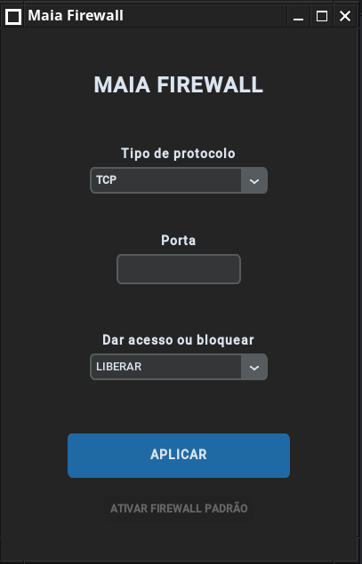

# Maia Firewall Version 0.1.0 - Alpha  
Maia Firewall será um front simples para meu script maiafirewall.sh existente no meu remaster

## Imagem do programa:

## Como executar o programa no Linux pc

Passo 1 - Baixar o projeto:
  
  `Baixar os arquivos da pasta`

Passo 2 - Entrar na pasta:
   
   `cd pasta`

Passo 3 - Ambiente virtual:

    python3 -m venv venv

Passo 4 - Entrar no ambiente virtual:

    source venv/bin/activate

Passo 5 - Instalar Requerimentos:

    pip install -r requerimentos.txt

Passo 6 - Abrir o programa:

    python main.py

## Observação:

  `Este programa faz uso dos seguintes programas:`
  
  `pkexec - para ler senha de usuario que tenha permissão elevada `
  
  `iptables - programa usado para adicionar regras de firewall`
